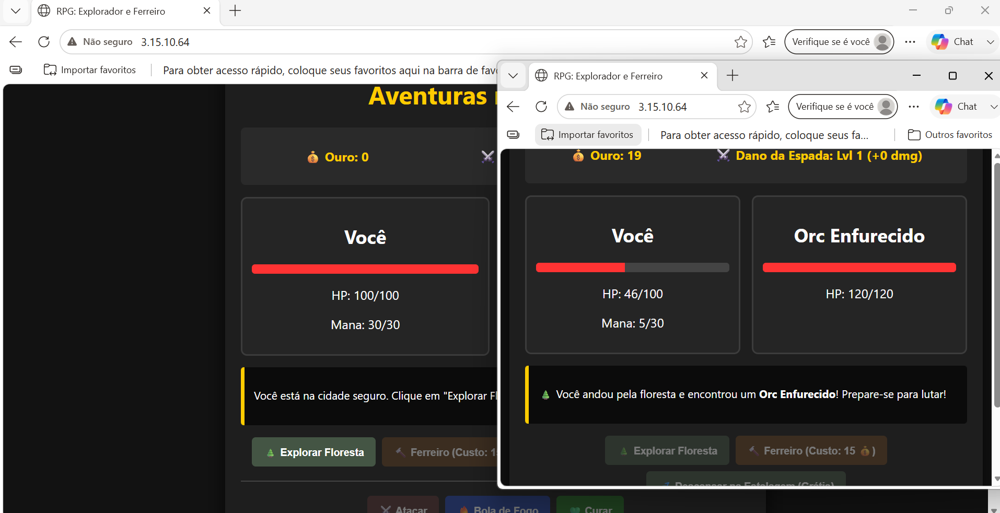

#  RPG: Explorador e Ferreiro — Infraestrutura Automatizada na AWS

Este repositório contém toda a arquitetura de infraestrutura como código (IaC) utilizando Terraform e a esteira de CI/CD via GitHub Actions para o deploy automatizado de um jogo RPG estilo Web. O projeto foi desenhado focando no isolamento completo entre o ambiente público (Frontend) e privado (Backend) para máxima segurança.

---

##  Demonstração do Jogo

As imagens abaixo mostram a interface do jogo rodando de forma totalmente automatizada e isolada dentro da nossa instância na AWS:

| Tela Inicial (Cidade Segura) | Sistema de Combate (Na Floresta) |
| :---: | :---: |
|  |  |

---

## 🏗️ Arquitetura da Infraestrutura & Rede (VPC)

O projeto utiliza conceitos avançados de rede na AWS para separar o tráfego que vem da internet daquilo que deve ficar protegido nos bastidores do servidor:

```text
[ INTERNET (Seu Navegador) ]
          │
          │ Porta 80 (HTTP)
          ▼
┌─────────────────────────────────── AWS VPC ───────────────────────────────────┐
│                                                                               │
│  🟢 SUBREDE PÚBLICA (Acessível da Internet)                                    │
│  ┌─────────────────────────────────────┐   ┌───────────────────────────────┐  │
│  │ Container: rpg-frontend (Porta 80)  │   │  🛰️ NAT Gateway               │  │
│  │ - Entrega a interface do jogo.      │   │  - Atrelado a um EIP (IP Fixo)│  │
│  └──────────────────┬──────────────────┘   └───────────────▲───────────────┘  │
│                     │                                      │                  │
│                     │ Requisições de API (Internas)        │ Acesso de Saída  │
│                     ▼                                      │ (Updates/Logs)   │
│  🔴 SUBREDE PRIVADA (Totalmente Isolada)                    │                  │
│  ┌─────────────────────────────────────────────────────────┴───────────────┐  │
│  │ Container: rpg-backend (Porta 5000)                                     │  │
│  │ - API que processa as regras de negócio e a lógica do RPG.              │  │
│  │ - NÃO possui IP público e está blindado contra ataques externos.       │  │
│  └─────────────────────────────────────────────────────────────────────────┘  │
└───────────────────────────────────────────────────────────────────────────────┘
